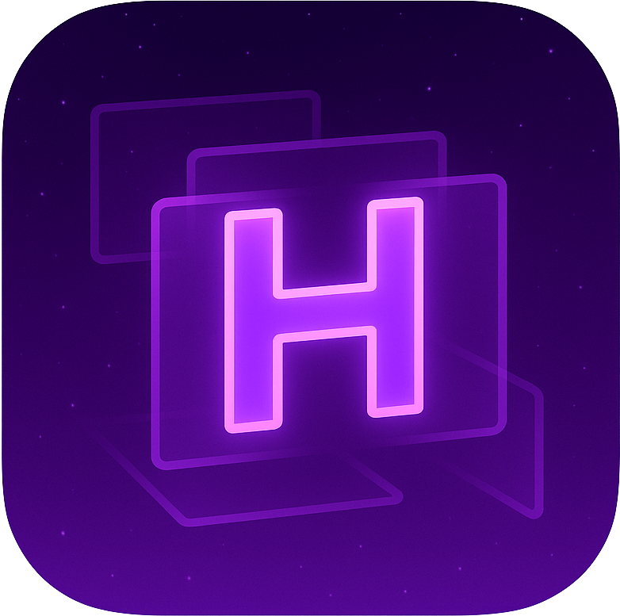

# HyprSpace

[](https://github.com/BarutSRB/HyprSpace/actions/workflows/ci.yml)
[](https://github.com/BarutSRB/HyprSpace/releases)
[](https://www.apple.com/macos/)
[](https://swift.org)
[](./LICENSE)
[](https://brew.sh)

**A Hyprland-inspired tiling window manager for macOS**

HyprSpace brings the powerful Hyprland tiling window manager experience to macOS, featuring a beautiful workspace bar that seamlessly blends with the macOS aesthetic while remaining unobtrusive, useful, and fully interactive with mouse support.

This project is a heavily modified fork of [AeroSpace](https://github.com/nikitabobko/AeroSpace) by nikitabobko, with additional components from [Barik](https://github.com/mocki-toki/barik) by mocki-toki.

## 🎯 Project Goals

- **Hyprland Experience on macOS**: Get as close as possible to the Hyprland tiling window manager experience while respecting macOS conventions
- **Beautiful Workspace Bar**: The best looking workspace bar that blends naturally into the macOS design language
- **Unobtrusive Yet Powerful**: Stay out of your way during regular use while providing powerful window management when needed
- **Mouse-Friendly**: Full mouse interactivity alongside keyboard-driven workflows
- **macOS Integration**: Seamless integration with native macOS features where it makes sense

## ✨ Key Features

- **Dwindle Layout**: Binary tree-based tiling layout system inspired by Hyprland
- **Fast Workspace Switching**: Instant workspace transitions without animations
- **Virtual Workspaces**: Custom workspace implementation that bypasses macOS Spaces limitations
- **Tree-Based Window Management**: Hierarchical window organization for complex layouts
- **Multi-Monitor Support**: Proper i3-like multi-monitor paradigm
- **Plain Text Configuration**: TOML-based config files (dotfiles friendly)
- **CLI First**: Complete command-line interface with man pages and shell completion
- **No SIP Required**: Works without disabling System Integrity Protection

## 📦 Installation

### Method 1: Homebrew (Recommended)

```bash
# Add the tap (once the tap is published)
brew tap barutsrb/hyprspace

# Install HyprSpace
brew install --cask hyprspace
```

### Method 2: Download DMG (Easy Installation)

1. Download the latest `.dmg` file from [GitHub Releases](https://github.com/BarutSRB/HyprSpace/releases/latest)
2. Open the DMG and drag HyprSpace to your Applications folder
3. Grant accessibility permissions when prompted on first launch
4. If macOS blocks the app: `xattr -cr /Applications/HyprSpace.app`

### Method 3: Download ZIP (Manual Installation)

1. Download the latest `HyprSpace-vX.X.X.zip` from [GitHub Releases](https://github.com/BarutSRB/HyprSpace/releases/latest)
2. Extract the zip file
3. Copy `HyprSpace.app` to `/Applications/`
4. Copy `bin/hyprspace` to your PATH (e.g., `/usr/local/bin/`)
5. Install man pages: `cp -r manpage/*.1 /usr/local/share/man/man1/`
6. Install shell completions (optional):
   - Bash: `cp shell-completion/bash/hyprspace /usr/local/share/bash-completion/completions/`
   - Zsh: `cp shell-completion/zsh/_hyprspace /usr/local/share/zsh/site-functions/`
   - Fish: `cp shell-completion/fish/hyprspace.fish ~/.config/fish/completions/`
7. If macOS blocks the app: `xattr -cr /Applications/HyprSpace.app`

### Method 4: Build from Source

```bash
git clone https://github.com/BarutSRB/HyprSpace.git
cd HyprSpace
./script/install-dep.sh
./build-release.sh
# Binaries will be in .release/ directory
# Or install locally as dev version:
./install-from-sources.sh
```

> [!NOTE]
> Future releases will include Apple notarization for a smoother installation experience. Currently, you may need to remove the quarantine attribute manually.

> [!IMPORTANT]
> **Accessibility Permissions Required**: On first launch, macOS will prompt you to grant Accessibility permissions to HyprSpace. Go to System Settings → Privacy & Security → Accessibility and enable HyprSpace.

## 🚀 Quick Start

1. **Install HyprSpace** using one of the methods above
2. **Grant Accessibility permissions** when prompted (required for window management)
3. **Start HyprSpace** by launching `HyprSpace.app` from Applications
4. **Configure** by editing `~/.hyprspace.toml` (copy from default config if needed)
5. **Learn the keybindings** (see below) - default uses `Alt` key like i3/Hyprland

### First Steps

- Press `Alt+Enter` to open a new terminal window (Ghostty by default)
- Press `Alt+H/J/K/L` to navigate between windows (Vim-style)
- Press `Alt+1/2/3/4/5` to switch workspaces
- Press `Alt+Shift+H/J/K/L` to move windows around
- Press `Alt+Shift+;` to enter service mode for advanced commands

## ⌨️ Default Keybindings

HyprSpace uses Alt (⌥) as the primary modifier key, similar to i3 and Hyprland:

### Window Navigation
- `Alt+H/J/K/L` - Focus window left/down/up/right (Vim-style)
- `Alt+Shift+H/J/K/L` - Move window left/down/up/right

### Workspace Management
- `Alt+1/2/3/4/5` - Switch to workspace 1-5
- `Alt+Shift+1/2/3/4/5` - Move focused window to workspace 1-5
- `Alt+Tab` - Toggle between current and previous workspace
- `Alt+Shift+Tab` - Move workspace to next monitor

### Window Resizing
- `Alt+-` - Shrink focused window
- `Alt+=` - Grow focused window

### Layouts
- `Alt+/` - Cycle through split orientations (horizontal/vertical)
- `Alt+,` - Reset to dwindle layout

### Application Launching
- `Alt+Enter` - Open new terminal (Ghostty)
- `Alt+Q` - Quit focused application

### Service Mode
- `Alt+Shift+;` - Enter service mode for advanced commands:
  - `Esc` - Reload config and return to main mode
  - `R` - Reset/flatten workspace layout
  - `F` - Toggle floating/tiling for focused window
  - `Backspace` - Close all windows except current
  - `Alt+Shift+H/J/K/L` - Join windows in direction
  - `Up/Down` - Volume up/down
  - `Shift+Down` - Mute volume

## 🛠️ Configuration

HyprSpace uses a TOML configuration file located at `~/.hyprspace.toml`.

### Getting the Default Config

The default configuration is included in the app bundle:
```bash
# From installed app
cp /Applications/HyprSpace.app/Contents/Resources/default-config.toml ~/.hyprspace.toml

# From source repository
cp docs/config-examples/default-config.toml ~/.hyprspace.toml
```

### Configuration Options

#### Basic Settings
```toml
# Start HyprSpace at login
start-at-login = true

# Dwindle is the only supported layout - binary tree-based tiling
default-root-container-layout = 'dwindle'

# Container orientation: horizontal|vertical|auto
# 'auto' = wide monitors get horizontal, tall monitors get vertical
default-root-container-orientation = 'auto'

# Run commands after startup
after-startup-command = ['layout dwindle']
```

#### Gaps Configuration
```toml
[gaps]
inner.horizontal = 14  # Gap between windows horizontally
inner.vertical = 14    # Gap between windows vertically
outer.left = 8         # Gap from left screen edge
outer.right = 8        # Gap from right screen edge
outer.top = 8          # Gap from top screen edge
outer.bottom = 8       # Gap from bottom screen edge
```

#### Keybindings
```toml
[mode.main.binding]
# Basic movement
alt-h = 'focus left'
alt-j = 'focus down'
alt-k = 'focus up'
alt-l = 'focus right'

# Move windows
alt-shift-h = 'move left'
alt-shift-j = 'move down'
alt-shift-k = 'move up'
alt-shift-l = 'move right'

# Workspace switching
alt-1 = 'workspace 1'
alt-2 = 'workspace 2'
# ... up to alt-5

# Resize windows
alt-minus = 'resize smart -50'
alt-equal = 'resize smart +50'

# Launch applications
alt-enter = 'exec-and-forget open -n -a "Ghostty"'
```

#### Keyboard Layouts
```toml
[key-mapping]
preset = 'qwerty'  # Options: qwerty, dvorak, colemak
```

#### Advanced Options
```toml
# Enable container normalization (recommended)
enable-normalization-flatten-containers = true
enable-normalization-opposite-orientation-for-nested-containers = true

# Mouse follows focus when switching monitors
on-focused-monitor-changed = ['move-mouse monitor-lazy-center']

# Automatically unhide macOS hidden apps (prevents accidental Cmd+H)
automatically-unhide-macos-hidden-apps = false
```

### Reload Configuration

After editing your config:
1. Press `Alt+Shift+;` to enter service mode
2. Press `Esc` to reload config and return to main mode

Or use the CLI: `hyprspace reload-config`

## 🤝 Community & Contributing

HyprSpace uses GitHub Discussions for community interaction. Please read [CONTRIBUTING.md](./CONTRIBUTING.md) before creating issues.

### Discussion Channels

- [General Discussions](https://github.com/barutsrb/HyprSpace/discussions)
- [Feature Ideas](https://github.com/barutsrb/HyprSpace/discussions/categories/feature-ideas)
- [Bug Reports](https://github.com/barutsrb/HyprSpace/discussions/categories/potential-bugs)
- [Q&A](https://github.com/barutsrb/HyprSpace/discussions/categories/questions-and-answers)

## 💻 CLI Commands

HyprSpace includes a powerful command-line interface. Some commonly used commands:

```bash
# Reload configuration
hyprspace reload-config

# List all windows with details
hyprspace list-windows --all

# Debug window information
hyprspace debug-windows

# Close all windows on current workspace
hyprspace close-all-windows-but-current

# Move focus
hyprspace focus left|right|up|down

# Switch workspace
hyprspace workspace 1|2|3|4|5

# Move window to workspace
hyprspace move-node-to-workspace 1|2|3|4|5

# Resize windows
hyprspace resize smart +50
hyprspace resize smart -50

# Change layout
hyprspace layout dwindle
hyprspace layout dwindle horizontal
hyprspace layout dwindle vertical

# Flatten workspace tree (reset layout)
hyprspace flatten-workspace-tree
```

For complete command reference, run `hyprspace --help` or `man hyprspace`.

## 🖥️ Multi-Monitor Setup

HyprSpace supports multiple monitors with i3-like workspace management:

### Important Notes

1. **Monitor Arrangement**: Ensure monitors are properly arranged in System Settings → Displays
   - Monitors should not overlap in the virtual space
   - Arrange them in the actual physical order (left to right, top to bottom)

2. **Workspaces**: Each monitor can have its own workspaces
   - Press `Alt+Shift+Tab` to move workspace to next monitor
   - Workspaces are independent per monitor by default

3. **Focus**: Mouse follows focus when switching monitors (configurable)

### Workspace to Monitor Assignment

You can assign specific workspaces to specific monitors in your config:

```toml
[workspace-to-monitor-force-assignment]
1 = 'main'              # Workspace 1 always on main monitor
2 = 'main'              # Workspace 2 always on main monitor
3 = 'secondary'         # Workspace 3 always on secondary monitor
4 = ['secondary', 1]    # Workspace 4 on second monitor
5 = ['secondary', 2]    # Workspace 5 on third monitor
```

## 🔧 Troubleshooting

### HyprSpace is not managing windows

1. **Check Accessibility Permissions**:
   - Go to System Settings → Privacy & Security → Accessibility
   - Ensure HyprSpace is enabled
   - If not listed, try running the app again

2. **Reset Accessibility Permissions** (for debug builds):
   ```bash
   ./script/reset-accessibility-permission-for-debug.sh
   ```

3. **Check if HyprSpace is running**:
   ```bash
   ps aux | grep HyprSpace
   ```

### Keybindings not working

1. **Check for conflicts**: Some apps or macOS shortcuts might conflict
2. **Verify config syntax**: Run `hyprspace reload-config` to check for errors
3. **Try different modifiers**: If Alt is not working, your terminal or app might be intercepting it

### Windows not tiling properly

1. **Reload config**: `Alt+Shift+;` then `Esc`
2. **Reset layout**: `Alt+Shift+;` then `R`
3. **Flatten workspace**: `hyprspace flatten-workspace-tree`

### App won't launch (macOS Quarantine)

If you see "cannot be opened because the developer cannot be verified":

```bash
# Remove quarantine attribute
xattr -d com.apple.quarantine /Applications/HyprSpace.app
xattr -d com.apple.quarantine /usr/local/bin/hyprspace
```

### Multi-monitor issues

1. **Rearrange monitors**: System Settings → Displays
2. **Restart HyprSpace** after changing monitor setup
3. **Check workspace assignments** in config

## 🚀 Development

### Prerequisites

- Swift 6.1.2+ (managed via [swiftly](https://swift-server.github.io/swiftly/))
- Xcode Command Line Tools: `xcode-select --install`
- Xcode (for release builds only, get from Mac App Store)
- macOS 13.0 (Ventura) or later

### Building from Source

```bash
# Clone the repository
git clone https://github.com/BarutSRB/HyprSpace.git
cd HyprSpace

# Install dependencies (SwiftFormat, SwiftLint, XcodeGen, etc.)
./script/install-dep.sh

# Build debug version (uses SPM, outputs to .debug/)
./build-debug.sh

# Run the debug build
./run-debug.sh

# Run tests
./run-tests.sh

# Format code
./format.sh
```

### Development Scripts

```bash
# Build release (requires Xcode, outputs to .release/)
./build-release.sh

# Install locally as hyprspace-dev cask
./install-from-sources.sh

# Clean project completely
./script/clean-project.sh

# Generate Xcode project (for Xcode development)
./generate.sh

# Run only Swift tests (faster than full test suite)
./run-swift-test.sh
```

### Code Signing for Development

To build the app bundle, create a self-signed certificate:

1. Open **Keychain Access**
2. Keychain Access → Certificate Assistant → Create a Certificate
3. Name: `hyprspace-codesign-certificate`
4. Identity Type: Self-Signed Root
5. Certificate Type: Code Signing

### Project Structure

- `Sources/AppBundle/` - Main window manager logic
- `Sources/Cli/` - CLI binary implementation
- `Sources/Common/` - Shared code and argument parsing
- `Sources/AppBundleTests/` - Unit tests
- `grammar/` - ANTLR parser grammar and shell completion
- `docs/` - Documentation and config examples

### Creating a Release

#### Automated Release (GitHub Actions)

Simply push a version tag to trigger the automated release:
```bash
git tag v1.0.0
git push origin v1.0.0
```

The GitHub Actions workflow will:
- Run all tests
- Build universal binaries (x86_64 + arm64)
- Sign with Developer ID (if configured)
- Notarize the app (if Apple credentials are configured)
- Create DMG installer
- Upload to GitHub Releases
- Update Homebrew tap automatically

#### Manual Release

1. **Test everything**:
   ```bash
   ./run-tests.sh
   ```

2. **Build release** (creates universal binary for x86_64 + arm64):
   ```bash
   ./build-release.sh --build-version "1.0.0"
   # With notarization (requires Apple Developer account):
   ./build-release.sh --build-version "1.0.0" --notarize \
     --apple-id "your@email.com" \
     --apple-id-password "app-specific-password" \
     --apple-team-id "TEAM123"
   ```

3. **Create DMG installer**:
   ```bash
   cd .release
   ./create-dmg.sh "HyprSpace-v1.0.0.dmg" "HyprSpace.app"
   ```

4. **Publish using automated script**:
   ```bash
   ./script/publish-release-automated.sh --build-version "1.0.0"
   ```

   Or manually create GitHub Release and upload:
   - `HyprSpace-v1.0.0.zip` - Complete package with app, CLI, docs
   - `HyprSpace-v1.0.0.dmg` - Drag-to-Applications installer

5. **Update Homebrew tap** (automatic with GitHub Actions or manual):
   ```bash
   ./script/build-brew-cask.sh --build-version "1.0.0"
   # Copy to your tap repository and commit
   ```

#### Setting up Distribution

For maintainers setting up distribution for the first time:

1. **GitHub Actions Secrets** (in repository settings):
   - `CODESIGN_IDENTITY`: Developer ID Application certificate name
   - `CERTIFICATES_P12`: Base64-encoded .p12 certificate file
   - `CERTIFICATES_PASSWORD`: Certificate password
   - `KEYCHAIN_PASSWORD`: Temporary keychain password
   - `APPLE_ID`: Apple ID for notarization
   - `APPLE_ID_PASSWORD`: App-specific password
   - `APPLE_TEAM_ID`: Apple Developer Team ID
   - `HOMEBREW_TAP_TOKEN`: GitHub token for tap repository updates

2. **Homebrew Tap Setup**:
   - Create repository named `homebrew-hyprspace`
   - Copy contents from `homebrew-tap-template/`
   - Run `./setup.sh` and follow instructions

For more details, see `CLAUDE.md` and `CONTRIBUTING.md`.

## 🙏 Credits & Acknowledgments

HyprSpace stands on the shoulders of giants:

- **[AeroSpace](https://github.com/nikitabobko/AeroSpace)** by [nikitabobko](https://github.com/nikitabobko) - The foundational tiling window manager this project is based on
- **[Barik](https://github.com/mocki-toki/barik)** by [mocki-toki](https://github.com/mocki-toki) - Additional components and inspiration for the workspace bar

Special thanks to the Hyprland community for inspiration and the macOS window management community for continued support and feedback.

## 📋 Project Status

HyprSpace is in active development. While stable for daily use, expect improvements and potential breaking changes as we work towards version 1.0.

### Roadmap to 1.0

- [ ] Immutable tree data structure for improved stability
- [ ] Enhanced shell-like command combinators
- [ ] Better integration with macOS native features
- [ ] Performance optimizations for large window counts
- [ ] Sticky windows support

## 💡 Tips & Tricks

Enable window dragging from anywhere (not just title bar):
```bash
defaults write -g NSWindowShouldDragOnGesture -bool true
```

Now hold `Ctrl+Cmd` and drag any part of a window to move it.

## 📄 License

HyprSpace is released under the MIT License. See [LICENSE](./LICENSE) for details.

## 🔗 Related Projects

- [Hyprland](https://hyprland.org/) - The Wayland compositor that inspired this project
- [Amethyst](https://github.com/ianyh/Amethyst) - Automatic tiling window manager for macOS
- [yabai](https://github.com/koekeishiya/yabai) - A tiling window manager for macOS based on binary space partitioning

---

*HyprSpace - Bringing the Hyprland experience to macOS* 🚀